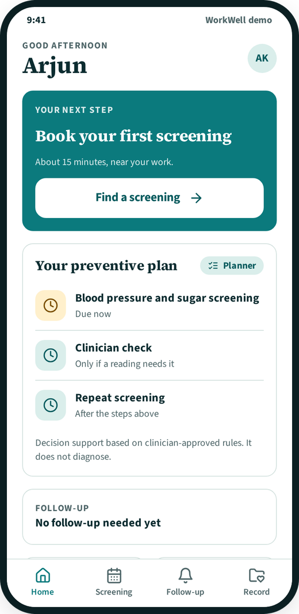
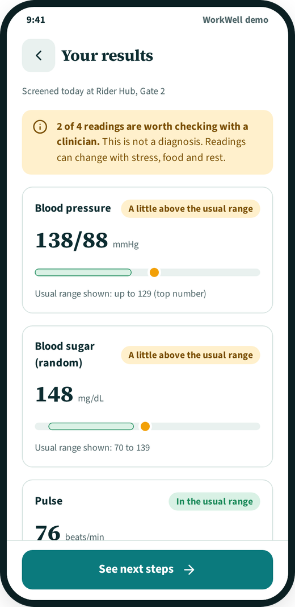
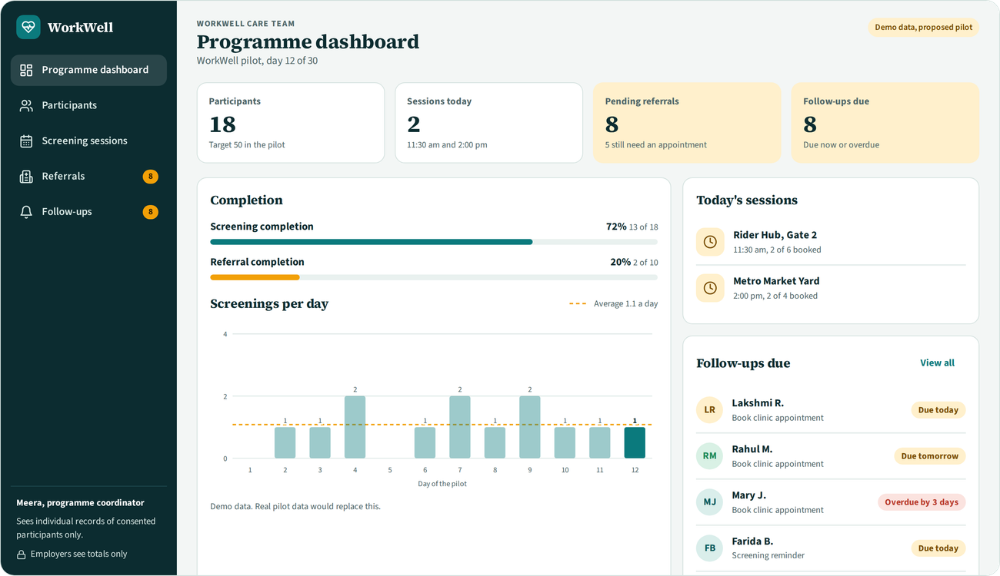

# WorkWell prototype

Preventive care that works around you.

WorkWell is a concept for a hybrid preventive-care access and care-navigation service for working adults, supported by technology. This repository holds the clickable prototype built for a Product Management MTA project on preventive care for working adults.

**Project team:** Dr. Enosh, Dr. Vaishnavi, Praharshitha

## What is in the prototype

One page, two surfaces, one shared demo dataset.

**Worker app (mobile):** welcome and language, create profile with consent, dashboard, find a screening near work, booking, confirmation with a QR pass, plain-language results, referral, and follow-up.

**Care team console (web):** programme dashboard, participants, participant detail, screening sessions, referrals, and follow-ups.

A booking or referral change made in the worker app shows up in the care team console, and the other way round. The programme figures are calculated from the participant list.

  
  

## Run it

No build step and no dependencies. Open `index.html` in a browser, or use the GitHub Pages link on this repository. It works at phone, tablet and desktop widths, in light and dark mode. Google Fonts are loaded from the web, and the page falls back to system fonts offline.

## Please read before using

- All participants, sessions and readings are **fictional demo data**.
- The five personas in the accompanying deck are illustrative, not research findings.
- The screening ranges and result wording are **demo values** and need clinician validation. The prototype gives decision support only and does not diagnose.
- The Hindi, Kannada, Malayalam, Telugu and Tamil strings are quick demo translations and need native review.
- Employers see aggregate participation totals only, never individual health data.
- The pilot described in the deck (50 participants, 1 workplace or community, 30 days) is a proposal, not a result.
- This is a concept prototype. Nothing is stored or sent anywhere.
